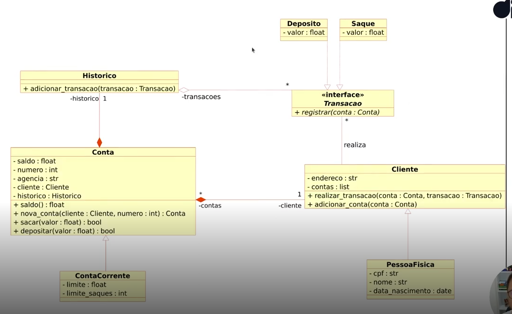

# Desafio - Atualizar sistema bancário usando POO

Atualizar a implementação do sistema bancário, para armazenar os dados de clientes e contas bancárias em objetos ao invés de dicionários. 
O código deve seguir o modelo de classes UML a seguir:
